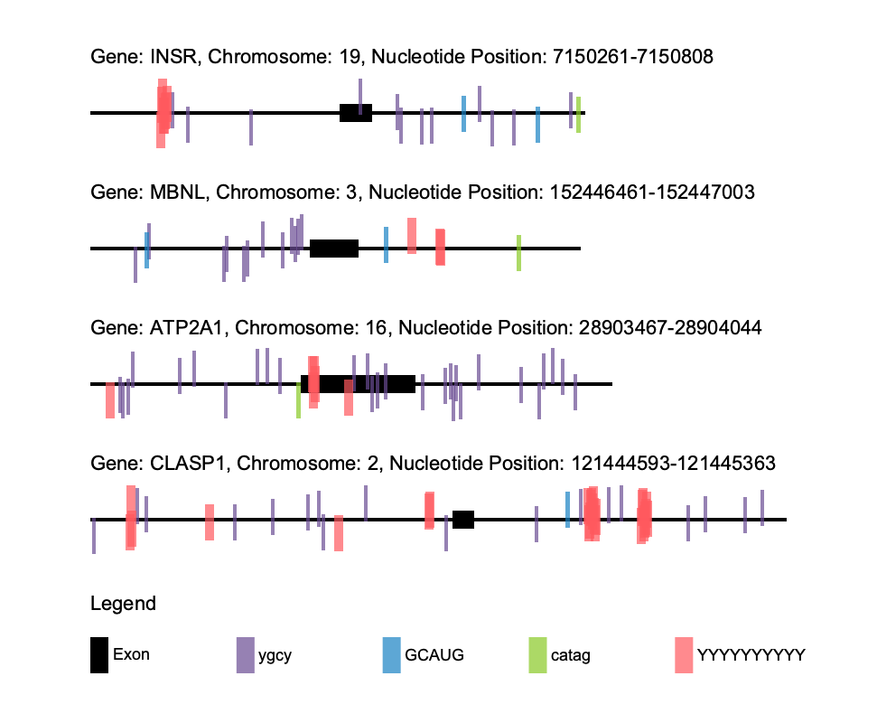

# motif-mark

## By: Jules Hays
## Due: 3/6/25

### About
Assignment goal: Write a python script using object-oriented code to visualize motifs on sequences.

Input:
* a fasta file of up to 10 sequences with up to 1000 bases per sequence
* a text file list of up to 5 motifs that are up to 10 bases long with 1 motif per line

Output:
* a to-scale PNG graphic illustration of each sequence overlaid with the found motifs. The outputted PNG will have the same file prefix as the inputted fasta file.

The script is capable of handling:
* Motifs with ambiguous nucleotides
* Multiple sequences and motifs at a time
* Overlapping motifs
* Gene sequences that include both introns and exons (exons denoted by all caps)

### Usage

File directory:
* ```lab_notebook.md``` -> details of the process to complete this assignment for the sake of reproducibility
* ```Figure_1.png``` -> example graphical output of the script given the provided test files, ```Figure_1.fasta``` and ```Fig_1_motifs.txt```
* ```motif-mark-oop.py``` -> script to make the drawing. Input is a fasta file of sequences and text file of motifs. Output is a png drawing

The script requies the installation of pycairo. To run this script, use the following command in the command line:
```
./motif-mark-oop.py -f <path to .fasta file> -m <path to motifs .txt file>
```

Here is a sample of what the graphical output of this script looks like:


