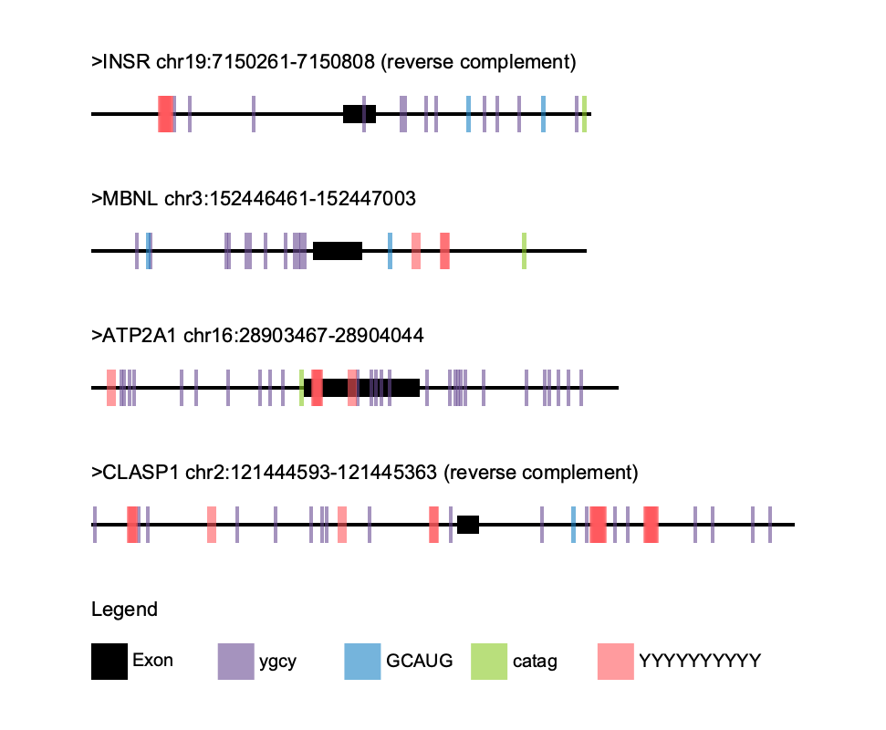

# motif-mark

## By: Jules Hays
## Due: 3/6/25

Assignment goal: Write a python script using object-oriented code to visualize motifs on sequences. The input is a .fasta file of sequences and a .txt file list of motifs. The output is a graphic illustration of each sequence overlaid with the found motifs.

File directory:
* ```lab_notebook.md``` -> details of the process to complete this assignment for the sake of reproducibility
* ```motif_drawing.png``` -> example graphical output of the script given the provided test files
* ```motif.py``` -> script to make the drawing. Input is a fasta file of sequences and text file of motifs. Output is a png drawing

To run this script, use the following command in the command line:
```
./motif.py -f <path to .fasta file> -m <path to motifs .txt file>
```

Here is a sample of what the graphical output of this script looks like:


